# 나만의 국내여행 플래너

도시 하나와 원하는 것을 문장으로 적으면, 실제 관광 데이터에서 조건에 맞는 장소를 골라 방문 순서와 선정 이유까지 담은 여행 계획 초안을 만들어 주는 웹 서비스.

**배포 URL** — https://codyssey-a1-3-iota.vercel.app/
**저장소** — https://github.com/codysseus42/codyssey-a1-3

---

## 목차

- [무엇을 해결하는가](#무엇을-해결하는가)
- [주요 기능](#주요-기능)
- [화면 구성](#화면-구성)
- [반응형](#반응형)
- [기술 스택](#기술-스택)
- [프로젝트 구조](#프로젝트-구조)
- [로컬 실행 방법](#로컬-실행-방법)
- [환경 변수](#환경-변수)
- [배포](#배포)
- [보너스 — 다크 모드](#보너스--다크-모드)
- [문서](#문서)
- [AI 코딩 도구 사용](#ai-코딩-도구-사용)
- [평가 기준 대응](#평가-기준-대응)

---

## 무엇을 해결하는가

경주 한 곳만 검색해도 관광지가 200곳 넘게 나온다. 목록은 인기순이거나 최신순일 뿐, 나의 상황과는 관계가 없다.

그리고 "부모님과 가는데 어머니 무릎이 안 좋으시다", "사람 많은 곳은 피하고 싶다" 같은 조건은 어떤 검색 필터에도 없다.

이 서비스는 **문장으로 말한 조건을 실제 장소 목록에 적용해 주는 것**을 목표로 한다. 도시를 고르고 원하는 것을 문장으로 쓰면, 해당 도시의 관광 데이터를 가져와 조건에 맞는 곳 4~7군데를 고르고, 각각을 왜 골랐는지와 어떤 순서로 도는 게 좋은지를 알려준다.

---

## 주요 기능

| 기능 | 설명 |
|---|---|
| 조건 기반 장소 선별 | 자유 문장으로 받은 여행 목적을 후보 80건에 적용해 4~7곳을 선정 |
| 동선 순서 제안 | 좌표를 기준으로 이동이 자연스러운 순서로 배열 |
| 선정 이유 제시 | 각 장소마다 왜 골랐는지 한 문장 |
| 전체 일정 요약 | 선정 결과를 묶어 설명하는 요약문 |
| 지도 연결 | 장소마다 카카오맵 길찾기 링크 |
| 계획 보관 | 브라우저 로컬 저장소에 저장, 목록에서 다시 열람·삭제 |
| 배색 전환 | 시스템 설정 자동 반영 + 수동 토글, 선택은 저장됨 |
| 반응형 | 창 폭에 따라 사이드/가로/햄버거 세 형태의 네비게이션 |

### 대상 도시

성격이 겹치지 않는 네 곳으로 고정했다.

| 도시 | 성격 | 후보 규모 |
|---|---|---|
| 강릉 | 자연·바다·휴양 | 관광지 149 · 음식점 482 |
| 경주 | 역사·유적 | 관광지 202 · 음식점 211 |
| 안동 | 전통·유교문화 | 관광지 107 · 음식점 27 |
| 여수 | 해안·야경 | 관광지 130 · 음식점 209 |

## 화면 구성

세 개의 섹션으로 구성하며, 상단·사이드·햄버거 네비게이션 중 창 폭에 맞는 형태로 이동할 수 있다.

### 계획 만들기

도시를 선택하고 희망사항을 문장으로 입력한다. 생성 중에는 경과 시간이 표시되는 대기 화면이 뜨고, 결과는 같은 화면 아래에 나타난다. 입력값이 유지되므로 문장을 고쳐 다시 생성할 수 있다.

장소마다 순서, 이름, 분류, 주소, 선정 이유, 사진, 지도 링크가 표시된다.

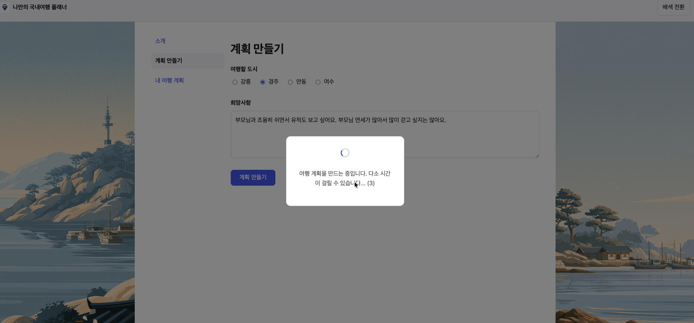
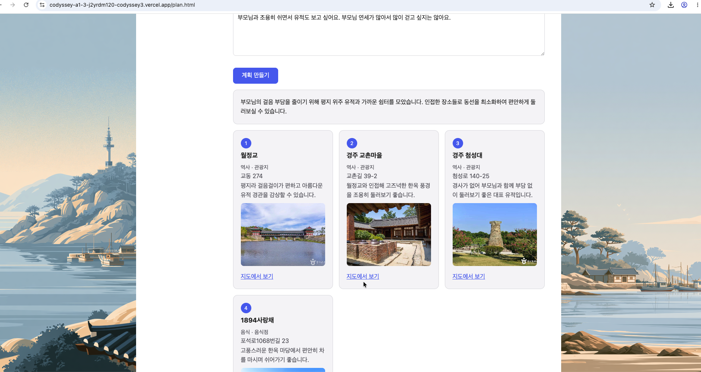

#### 필수 값 미입력, 하루 횟수 소진


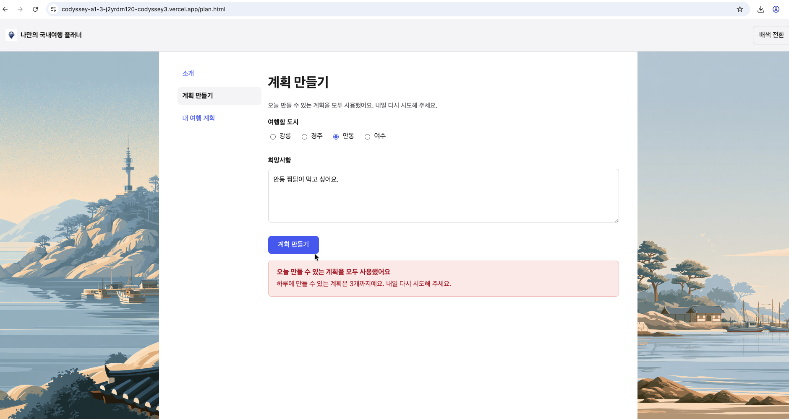

javascript단에서 경고

#### ai 내용문제

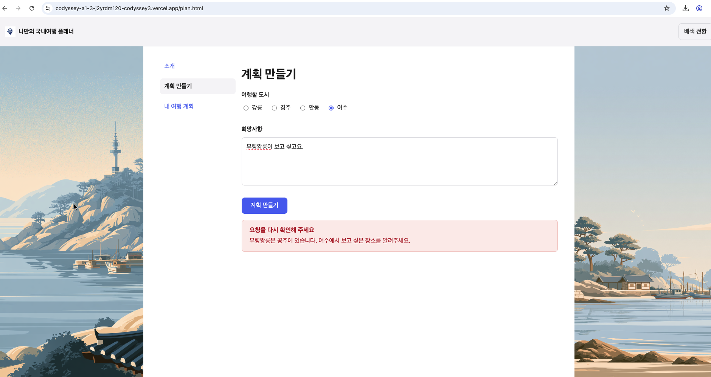


#### ai 기능
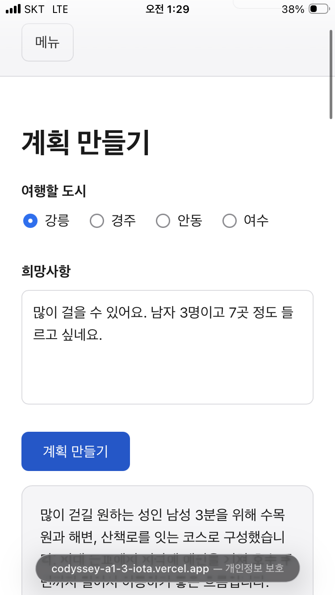


7곳을 요청한 결과가 반영되었다.

### 내 여행 계획

저장된 계획을 최신순으로 보여준다. 항목을 클릭하면 입력값과 결과가 복원되고, 개별 삭제가 가능하다.

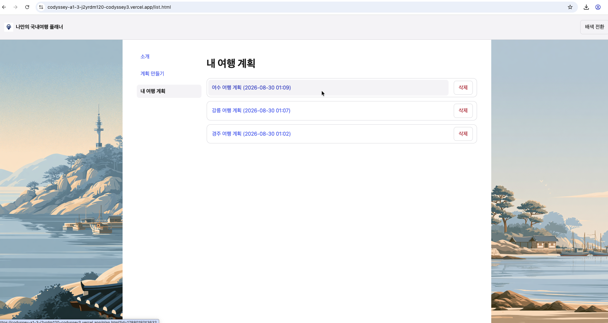

저장된 계획이 없을 때는 안내를 표시한다.

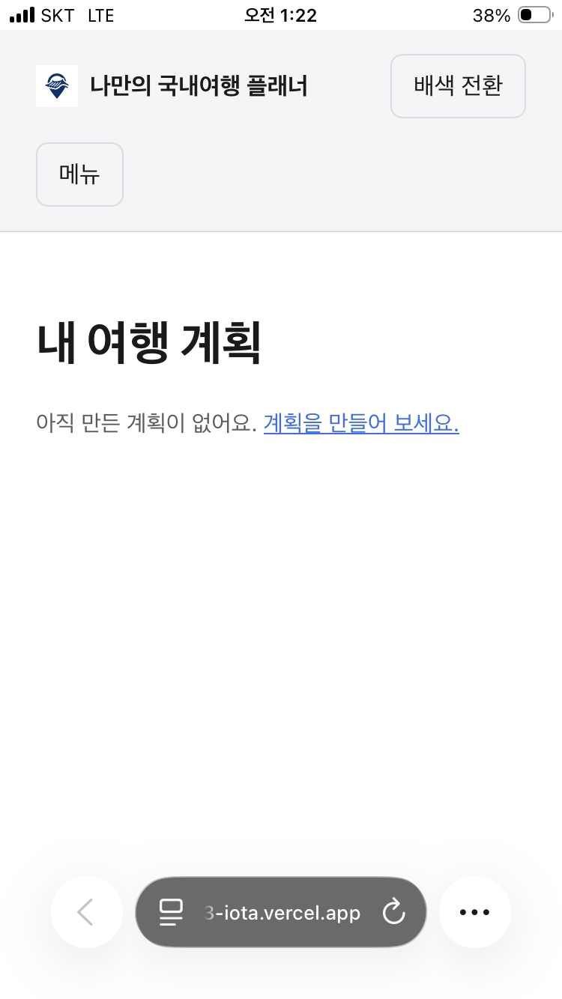

---

## 반응형

창 폭에 따라 네비게이션 형태와 레이아웃이 바뀐다. 기기 종류가 아니라 폭을 기준으로 하므로, 화면을 가로로 돌리면 즉시 다른 형태로 전환된다.

| 폭 | 네비게이션 |
|---|---|
| 1000px 이상 | 사이드 네비게이션 |
| 600px 이상 1000px 미만 | 상단 가로 네비게이션 |
| 600px 미만 | 햄버거 버튼 |

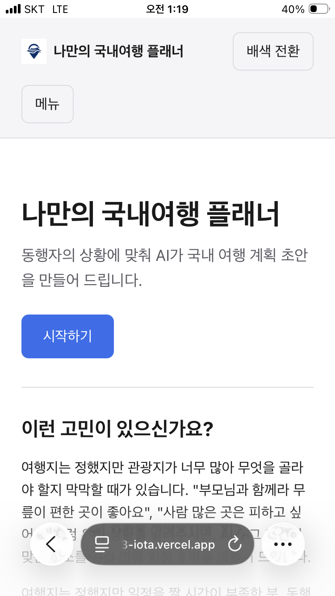


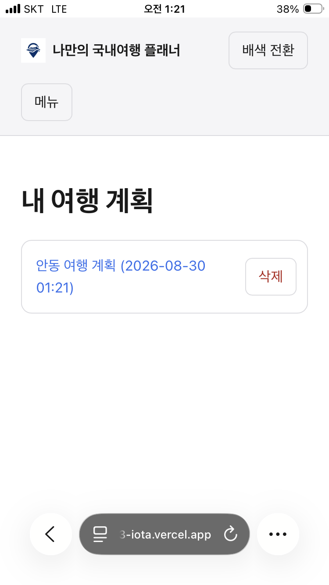

---

## 기술 스택

**프론트엔드**
- HTML, CSS, 바닐라 JavaScript
- 프레임워크와 라이브러리를 사용하지 않음
- CSS 변수 기반 배색, `@media` 반응형

**백엔드**
- Vercel Serverless Functions (Python)
- `http.server.BaseHTTPRequestHandler`
- `requests` 2.34.2, `python-dotenv`

**외부 API**
- [한국관광공사 국문 관광정보 서비스](https://www.data.go.kr) — `KorService2 / areaBasedList2`
- Google Gemini API — 장소 선별·순서·이유 생성

**배포**
- GitHub 연동 Vercel 자동 배포

---

## 프로젝트 구조

```
codyssey-a1-3/
├── README.md
├── SERVICE_PLAN.md            서비스 기획서
├── ARCHITECTURE.md            구현 사양
├── DECISIONS.md               설계 판단 기록
├── AI_CODING_LOG.md           AI 코딩 도구 사용 기록
├── CLAUDE.md                  AI 코딩 도구 상시 규칙
├── readImage/                 증빙 스크린샷
├── docs/evidence/             AI 코딩 도구 대화 원문
└── service/                   ← Vercel Root Directory
    ├── index.html             소개
    ├── plan.html              계획 만들기
    ├── list.html              내 여행 계획
    ├── requirements.txt
    ├── .env.example
    ├── css/style.css
    ├── js/
    │   ├── nav.js             네비게이션·배색 토글 (세 페이지 공용)
    │   ├── storage.js         로컬 저장소 접근
    │   ├── plan.js
    │   └── list.js
    ├── api/
    │   ├── plan.py            진입점 (POST /api/plan)
    │   ├── tour.py            관광 API 호출과 정규화
    │   ├── gemini.py          AI 호출과 응답 검증
    │   ├── cities.py          도시 코드·분류 매핑
    │   └── prompts/select_places.txt
    └── images/
```

### 데이터 흐름

```
브라우저  →  POST /api/plan { city, wish }
              ↓
plan.py   →  tour.py    관광지(50) + 음식점(30) 조회, 정규화, 번호 부여
              ↓
          →  gemini.py  후보 목록 + 희망사항 → 선별 결과(번호 + 이유)
              ↓
          →  번호로 원본 데이터 복원 → 응답 조립
              ↓
브라우저  →  결과 렌더링 + 로컬 저장소 보관
```

AI는 **번호만 반환하고 장소명은 반환하지 않는다.** 화면에 나가는 장소 정보는 전부 관광 API 원본이므로, 존재하지 않는 장소가 결과에 섞일 수 없다.

---

## 로컬 실행 방법

### 1. 저장소 클론

```bash
git clone https://github.com/codysseus42/codyssey-a1-3.git
cd codyssey-a1-3/service
```

### 2. 환경 변수 설정

```bash
cp .env.example .env
```

`.env`를 열어 아래 [환경 변수](#환경-변수) 표를 참고해 값을 채운다.

### 3. Vercel CLI로 실행

```bash
npm install -g vercel
vercel dev
```

`http://localhost:3000`에서 정적 파일과 서버리스 함수가 함께 동작한다.

> 정적 화면만 확인하려면 `python3 -m http.server`로도 되지만, `/api/plan`이 동작하지 않아 AI 기능을 쓸 수 없다.

---

## 환경 변수

| 변수 | 설명 | 발급처 |
|---|---|---|
| `TOUR_API_KEY` | 관광정보 API 인증키. **디코딩 키**를 넣는다 | [공공데이터포털](https://www.data.go.kr)에서 "한국관광공사_국문 관광정보 서비스_GW" 활용신청 |
| `GEMINI_API_KEY` | Gemini API 키 | [Google AI Studio](https://aistudio.google.com) |
| `TEXT_MODEL` | 기본 모델 식별자 (예: `gemini-3.6-flash`) | — |
| `TEXT_MODEL_FALLBACK` | 모델 과부하 시 사용할 대체 모델 | — |

**`TOUR_API_KEY`는 인코딩 키가 아니라 디코딩 키다.** 인코딩 키를 넣으면 `requests`가 한 번 더 인코딩해 인증에 실패한다.

모델 식별자를 소스에 두지 않고 환경 변수로 분리한 이유는, 모델 교체 시 코드 변경과 재배포 없이 설정만 바꾸면 되기 때문이다. 엔드포인트 주소는 비밀도 아니고 환경마다 달라지지도 않으므로 소스의 상수로 관리한다.

`.env`는 저장소에 올리지 않는다. `.env.example`에는 변수 이름만 값 없이 남아 있다.

---

## 배포

GitHub 저장소를 Vercel에 연결하고 `main` 브랜치에 push하면 자동 배포된다.

**프로젝트 설정**

| 항목 | 값 |
|---|---|
| Framework Preset | Other |
| Root Directory | `service` |
| Function Max Duration | 300초 |

환경 변수 네 개를 Vercel 프로젝트 설정에 등록해야 한다. **값을 등록하거나 변경한 뒤에는 재배포해야 반영된다.** 환경 변수는 배포 시점에 함수에 주입되므로, 대시보드에서 값만 고치면 기존 배포는 이전 값을 그대로 사용한다.

---

## 보너스 — 다크 모드

시스템 설정을 자동으로 따르되, 사용자가 직접 전환할 수도 있다. 선택은 브라우저에 저장되어 다음 방문에도 유지된다.

**구현 방법**

색상을 CSS 변수로만 정의하고, 세 층으로 우선순위를 둔다.

```css
:root { --bg: #ffffff; --fg: #1a1a1a; }

@media (prefers-color-scheme: dark) {
  :root { --bg: #16181c; --fg: #e8e8e8; }
}

:root[data-theme="dark"]  { --bg: #16181c; --fg: #e8e8e8; }
:root[data-theme="light"] { --bg: #ffffff; --fg: #1a1a1a; }
```

기본값은 시스템 설정을 따르고, `html` 요소에 `data-theme` 속성이 붙으면 그것이 우선한다. 토글 버튼은 이 속성을 바꾸고 값을 로컬 저장소에 기록하며, 페이지 로드 시 저장된 값을 다시 적용한다. 이 동작은 세 페이지가 공유하는 `js/nav.js`에 있다.

선택자 안에 색상값을 직접 쓰지 않으므로, 새 요소를 추가해도 배색이 자동으로 따라온다.

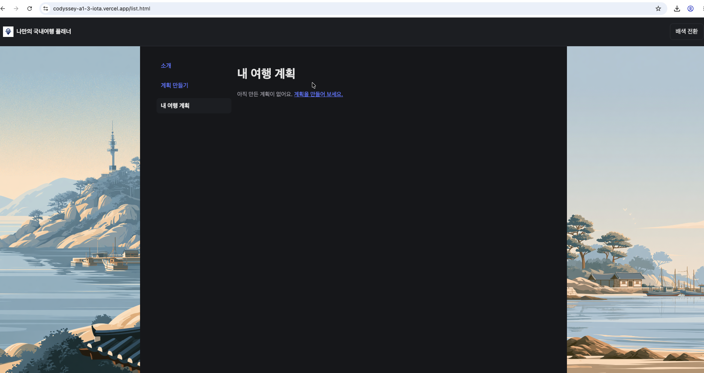

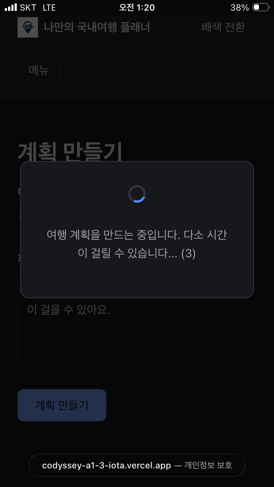

---

## 문서

| 문서 | 내용 |
|---|---|
| [SERVICE_PLAN.md](./service_plan.md) | 서비스 기획서 — 목적, 대상 사용자, 화면 구성, AI 기능 명세(입력/출력/실패 처리) |
| [ARCHITECTURE.md](./architecture.md) | 구현 사양 — API 계약, 외부 API 호출 규칙, 검증 순서, 시간 예산 |
| [AI_CODING_LOG.md](./AI_CODING_LOG.md) | AI 코딩 도구 사용 기록 |
| [CLAUDE.md](./CLAUDE.md) | AI 코딩 도구 상시 규칙 |

---

## AI 코딩 도구 사용

Claude Code를 사용했다. 구현 사양(`ARCHITECTURE.md`)을 먼저 확정하고, 파일 단위로 계획을 검토·승인한 뒤 작성하는 방식으로 진행했다.

- 작업 기록 — [AI_CODING_LOG.md](./AI_CODING_LOG.md)
- 대화 원문 — [docs/evidence/AI_CODING_TRANSCRIPT.md](./docs/evidence/AI_CODING_TRANSCRIPT.md)

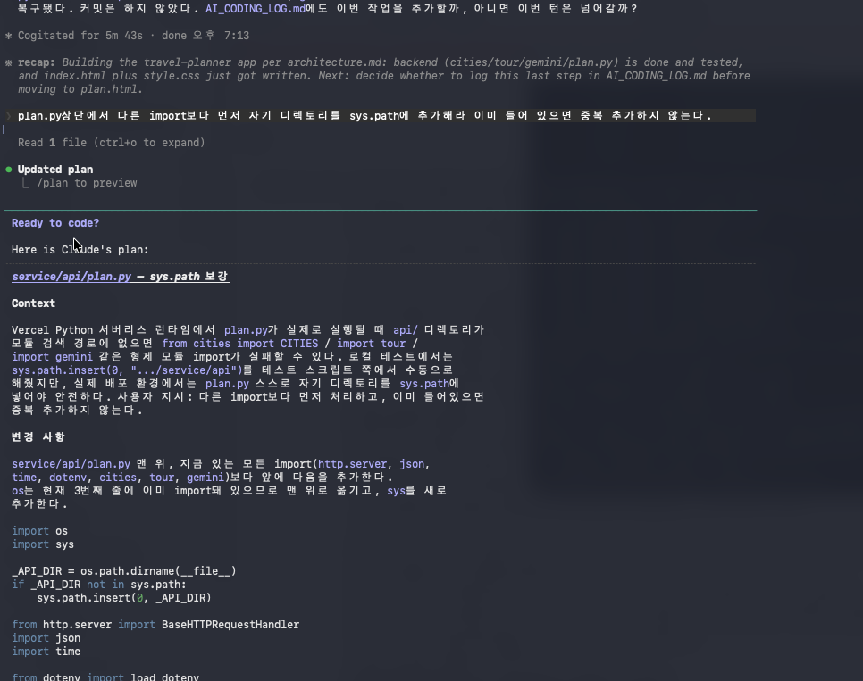

### 배포 환경에서 발견해 수정한 문제

로컬에서 정상 동작하던 코드가 배포 환경에서 실패한 사례 두 건.

**1. `ModuleNotFoundError: No module named 'cities'`**

Vercel은 `api/plan.py`를 스크립트로 실행하지 않고 모듈로 import한다. 이때 `sys.path`에는 `/var/task`만 포함되고 `/var/task/api`는 포함되지 않아 형제 모듈을 찾지 못했다. 로컬에서는 스크립트 실행이라 스크립트의 디렉토리가 `sys.path`에 자동으로 추가되어 문제가 드러나지 않았다.

`plan.py` 진입부에서 자기 디렉토리를 `sys.path`에 추가해 해결했다.

**2. `ai_failed / cause=request_invalid`**

Gemini API가 인증 실패를 401이 아니라 **400 + `INVALID_ARGUMENT`**로 반환해, 요청 형식 오류로 오분류되고 있었다. 응답 본문의 `error.message`를 서버 로그에 남기도록 수정한 뒤 `API key not valid`를 확인했다.

올바른 값을 등록하고 재배포해 해결했으며, 이후 400 응답 중 인증 오류를 구분해 분류하도록 `gemini.py`를 수정했다. 상태 코드만으로 원인을 판단할 수 없다는 것을 확인한 사례다.

---

## 데이터 출처

관광 정보는 [한국관광공사 국문 관광정보 서비스](https://www.data.go.kr)의 공공데이터를 이용한다.

---

## 평가 기준 대응

### 1. 아이디어 정의 및 화면 설계

| 평가 항목 | 대응 위치 |
|---|---|
| 목적 정의 | [무엇을 해결하는가](#무엇을-해결하는가) · [SERVICE_PLAN.md](./service_plan.md) |
| 타겟 사용자 정의 | [대상 사용자](#대상-사용자) · [SERVICE_PLAN.md](./service_plan.md) |
| 페이지/섹션 3개 이상 설계 | [화면 구성](#화면-구성) — 소개 / 계획 만들기 / 내 여행 계획 |
| 메뉴 이동 방식 | [반응형](#반응형) — 폭에 따라 사이드·가로·햄버거 |
| AI 기능 1개 이상 정의(입력/출력/가치) | [AI 기능](#ai-기능) · [SERVICE_PLAN.md](service_plan.md) |

### 2. 프로젝트 초기화 및 구조 구성

| 평가 항목 | 대응 위치 |
|---|---|
| 기본 폴더 구조 (`index.html`, `css/`, `js/`, `api/`, `images/`, `requirements.txt`) | [프로젝트 구조](#프로젝트-구조) |
| GitHub 저장소| [본페이지](https://github.com/codysseus42/codyssey-a1-3) |

### 3. 프론트엔드 화면 구현 (바닐라)

| 평가 항목 | 대응 위치 |
|---|---|
| 메인 및 추가 페이지 구현 | [화면 구성](#화면-구성) |
| 페이지 간 네비게이션 제공 | [반응형](#반응형) |
| 기본 레이아웃과 스타일 적용 | [기술 스택](#기술-스택) — CSS 변수 기반 공통 스타일시트 1개 |
| 프레임워크 미사용 | [기술 스택](#기술-스택) |

### 4. 반응형 적용 및 확인

| 평가 항목 | 대응 위치 |
|---|---|
| 모바일/태블릿/데스크톱 레이아웃 유지 | [반응형](#반응형) — 경계 600px / 1000px |
| 최소 2가지 화면 크기에서 확인 | [반응형](#반응형) — 데스크톱·모바일 캡처 |

### 5. AI 기능 UX 최소 기준

| 평가 항목 | 대응 위치 |
|---|---|
| 사용자 입력 UI 제공 | [계획 만들기](#계획-만들기) |
| AI 결과 화면 표시 | [AI 기능](#ai-기능) |
| 실패 처리 안내 — 빈 입력(필수값 누락) | [실패 처리](#실패-처리) |
| 실패 처리 안내 — API 오류(4xx/5xx) | [실패 처리](#실패-처리) |
| 실패 처리 안내 — 지연/타임아웃 | [실패 처리](#실패-처리) — 대기 화면 + 시간 예산 |

### 6. AI API 연동 (백엔드)

| 평가 항목 | 대응 위치 |
|---|---|
| `api/`에 Python 함수 구현 | [프로젝트 구조](#프로젝트-구조) — `api/plan.py` |
| AI API 호출 후 결과 반환 | [데이터 흐름](#데이터-흐름) · [ARCHITECTURE.md](./architecture.md) 5절 |
| `requirements.txt` 정의 | [프로젝트 구조](#프로젝트-구조) |
| 프론트에서 `fetch('/api/...')` 호출 | [데이터 흐름](#데이터-흐름) — `POST /api/plan` |

### 7. 배포 및 동작 검증

| 평가 항목 | 대응 위치 |
|---|---|
| GitHub–Vercel 연동 배포 | [배포](#배포) |
| 배포 URL에서 전체 기능 동작 확인 | [화면 구성](#화면-구성) · [반응형](#반응형) |
| 문제 발생 시 수정 후 재배포 | [배포 환경에서 수정한 문제](#배포-환경에서-수정한-문제) |

### 8. 문서화 및 제출 패키지

| 평가 항목 | 대응 위치 |
|---|---|
| README — 소개 | [무엇을 해결하는가](#무엇을-해결하는가) |
| README — 기술 스택 | [기술 스택](#기술-스택) |
| README — 배포 URL | 문서 상단 |
| README — 실행 방법 | [로컬 실행 방법](#로컬-실행-방법) |
| README — 환경 변수 | [환경 변수](#환경-변수) |
| 스크린샷 증빙 | 본문 전반 · `readImage/` |
| AI 코딩 도구 사용 증빙 | [AI 코딩 도구 사용](#ai-코딩-도구-사용) · [AI_CODING_LOG.md](./AI_CODING_LOG.md) · [대화 원문](./docs/evidence/AI_CODING_TRANSCRIPT.md) |
| 서비스 기획서 | [SERVICE_PLAN.md](./service_plan.md) |

---

## 제약 사항 대응

| 제약 항목 | 준수 내용 | 대응 위치 |
|---|---|---|
| 프론트엔드는 순수 HTML/CSS/JavaScript로 구현 (프레임워크 금지) | 라이브러리·프레임워크·빌드 도구를 사용하지 않음 | [기술 스택](#기술-스택) |
| 백엔드는 Vercel Serverless Functions(Python), `api/` 폴더 | `api/plan.py`를 진입점으로 하는 Python 함수 | [프로젝트 구조](#프로젝트-구조) |
| AI 기능 1개 이상 포함 | 후보 장소 선별·순서 배치·이유 생성 | [AI 기능](#ai-기능) |
| API 키를 코드에 직접 작성하지 않고 환경 변수로 관리 | 4개 값을 `.env` / Vercel 환경 변수로 주입. `.env`는 저장소에 올리지 않으며 `.env.example`에는 이름만 남김 | [환경 변수](#환경-변수) |
| 제출물에 키가 노출되지 않도록 주의 | 로그·오류 메시지에 요청 URL 전문과 키를 남기지 않음. 대화 원문도 커밋 전 검사 | [환경 변수](#환경-변수) · [ARCHITECTURE.md](./architecture.md) 9절 |
| AI API는 과금/쿼터가 발생할 수 있음을 인지하고, 호출 빈도와 실패 상황을 고려 | 하루 생성 횟수 제한, 실패한 요청은 차감하지 않음. 필수값 미입력은 네트워크 요청 전에 차단. 대체 모델은 일시적 과부하로 판단될 때만 1회 시도 | [실패 처리](#실패-처리) |
| 템플릿·예시를 그대로 복제하지 않음 | 아이디어·문구·화면 구성을 직접 설계 | [무엇을 해결하는가](#무엇을-해결하는가) · [SERVICE_PLAN.md](./service_plan.md) |

### 보너스

| 평가 항목 | 대응 위치 |
|---|---|
| 보너스 1 — 데이터 저장 고도화 | [내 여행 계획](#내-여행-계획) — 로컬 저장소 보관·복원·삭제 |
| 보너스 2 — UX 고도화(다크 모드) | [보너스 다크 모드](#보너스-다크-모드) |

---
